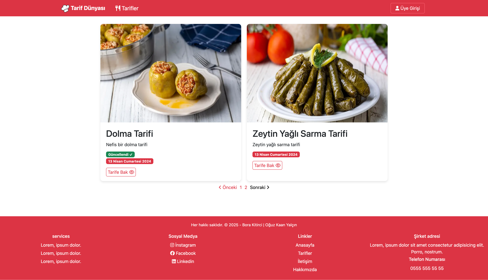
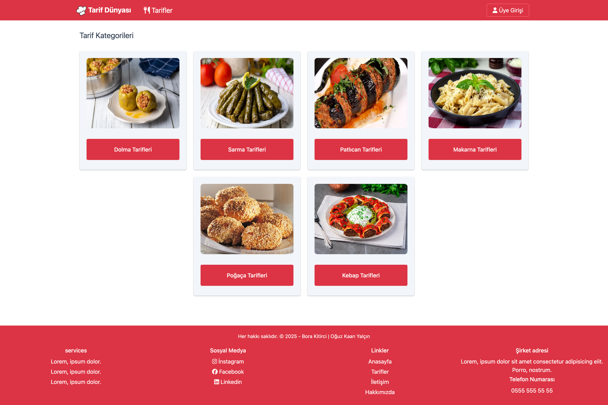
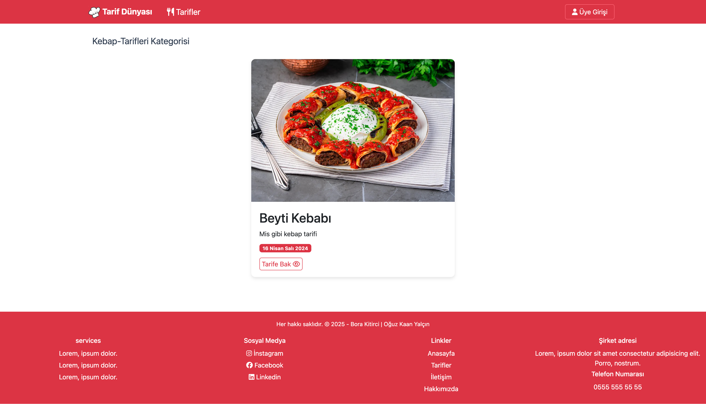

# 🍽 Django ile Geliştirilmiş Yemek Tarifleri Uygulaması

Bu proje, kullanıcıların yemek tariflerini kategoriye göre listeleyip filtreleyebildiği, tarif detaylarını inceleyebildiği modern bir web uygulamasıdır. Ayrıca, yönetici kullanıcılar için tarif ve kategori yönetimi gibi işlemlerin yapılabildiği kapsamlı bir yönetim paneli sunulmaktadır.

Proje, Python tabanlı Django web çatısı kullanılarak geliştirilmiştir. Veritabanı olarak SQLite tercih edilmiştir. Arayüz tasarımı için Bootstrap kütüphanesi kullanılarak responsive (mobil uyumlu) ve kullanıcı dostu bir deneyim sağlanmıştır.

---

## Ana sayfa Görünümü

## Ana sayfa Görünümü - 2

## Tarif Kategorileri Sayfası

## Kategori İçerik Sayfası

## Yemek Tarifi Sayfası

---

## Geliştiriciler

- [Oğuz Kaan Yalçın](https://github.com/oguzkaanyalcin)
- [Bora Kitirci](https://github.com/bboraki)
